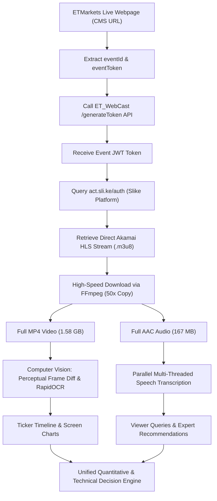

# 📘 Comprehensive Guide: Downloading & Analyzing ET Prime StockTalk Live Broadcasts

This technical guide provides an end-to-end blueprint for discovering, downloading, and automatically analyzing **Economic Times (ET) Prime Members StockTalk** live streams and recorded sessions.

---

## 🏗️ Architectural Overview



---

## 🛠️ Step 1: Extracting Event Metadata & Stream Identifiers

On any Economic Times live stream page (e.g., `https://economictimes.indiatimes.com/markets/etmarkets-live/stocktalk:-get-your-query-answered-by-expert/streamsrecorded/streamid-npnr7yqgz6,expertid-133.cms`):

1. Inspect the DOM element with class `.jsPlaySreamIframe` or search page source:
   - **`data-id` (`eventId`):** e.g., `npnr7yqgz6`
   - **`data-eventtoken` (`eventToken`):** e.g., `00VUDbkoENHET1w9`
   - **`data-expertid`:** e.g., `133` (Stock Talk)

---

## 🔐 Step 2: Generating the Slike JWT Token

ET uses an internal token generator endpoint to issue temporary JWT tokens for the Slike video player.

### Python Script: `generate_et_jwt.py`
```python
import urllib.request
import json

def get_et_jwt(event_id, event_token):
    url = "https://etwebcast.indiatimes.com/ET_WebCast/generateToken"
    headers = {
        "Accept": "application/json",
        "Content-Type": "application/json",
        "token": "18huogo9zl6gollkog9kzkoz6l69ggl9",  # Production Slike API token
        "User-Agent": "Mozilla/5.0 (Windows NT 10.0; Win64; x64)"
    }
    payload = {
        "eventID": event_id,
        "userID": "guest@et.com",
        "name": "Guest",
        "role": 0,
        "eventToken": event_token,
        "meta": {"isloggedin": True, "section": "LS_Recorded_Web"}
    }
    
    req = urllib.request.Request(url, data=json.dumps(payload).encode("utf-8"), headers=headers)
    res = urllib.request.urlopen(req, timeout=10).read().decode("utf-8")
    data = json.loads(res)
    return data.get("token")

# Example usage:
jwt_token = get_et_jwt("npnr7yqgz6", "00VUDbkoENHET1w9")
print("Generated JWT:", jwt_token[:50] + "...")
```

---

## 📡 Step 3: Resolving the Direct Akamai CDN Stream URL

With the JWT token, authenticate against `https://act.sli.ke/auth`:

### Python Script: `resolve_stream_url.py`
```python
import urllib.request
import json

def get_hls_stream(event_id, jwt_token):
    url = "https://act.sli.ke/auth"
    headers = {
        "Accept": "application/json, text/plain, */*",
        "Content-Type": "application/json",
        "Origin": "https://cpl.sli.ke",
        "Referer": "https://cpl.sli.ke/",
        "User-Agent": "Mozilla/5.0 (Windows NT 10.0; Win64; x64)"
    }
    payload = {
        "event": event_id,
        "jwt": jwt_token
    }
    
    req = urllib.request.Request(url, data=json.dumps(payload).encode("utf-8"), headers=headers)
    res = urllib.request.urlopen(req, timeout=10).read().decode("utf-8")
    data = json.loads(res)
    
    # Extract master URL or recording URL
    recording_info = data.get("data", {}).get("recording", {})
    m3u8_url = recording_info.get("URL")
    return m3u8_url

# Result: https://slike-et.akamaized.net/live/npnr7yqgz6/npnr7yqgz6.m3u8
```

---

## ⚡ Step 4: High-Speed Video & Audio Download via FFmpeg

Because the video segments on Akamai CDN are unencrypted Transport Streams (`.ts`), FFmpeg can download and remux them without re-encoding at **50x real-time speed** (a 6.3-hour video downloads in ~6 to 7 minutes!).

### ⚠️ Essential Reconnect Flags
To prevent FFmpeg from halting on minor network drops during a multi-hour stream, always supply:
`-reconnect 1 -reconnect_at_eof 1 -reconnect_streamed 1 -reconnect_delay_max 10`

### Command: Download Full MP4 Video
```bash
ffmpeg -y -headers "User-Agent: Mozilla/5.0\r\n" \
  -reconnect 1 -reconnect_at_eof 1 -reconnect_streamed 1 -reconnect_delay_max 10 \
  -i "https://slike-et.akamaized.net/live/npnr7yqgz6/m/stream_npnr7yqgz6.m3u8" \
  -c copy "ET_StockTalk_Live.mp4"
```

### Command: Download Audio Track (Only 1–2 minutes download time)
```bash
ffmpeg -y -headers "User-Agent: Mozilla/5.0\r\n" \
  -reconnect 1 -reconnect_at_eof 1 -reconnect_streamed 1 -reconnect_delay_max 10 \
  -i "https://slike-et.akamaized.net/live/npnr7yqgz6/m/stream_npnr7yqgz6.m3u8" \
  -vn -c:a copy "ET_StockTalk_audio.aac"
```

---

## 👁️ Step 5: Visual Chart Analysis Pipeline (Fast Scene-Change OCR)

Instead of running slow OCR on every single frame, we extract frames at a sample rate (e.g. 1 frame every 20 seconds) and compute a **perceptual difference (`cv2.absdiff`)** on the TradingView header box.

```python
import cv2
import numpy as np
from rapidocr_onnxruntime import RapidOCR

ocr = RapidOCR()

def detect_chart_transitions(frame_paths):
    prev_crop = None
    transitions = []
    
    for idx, path in enumerate(frame_paths):
        img = cv2.imread(path)
        h, w, _ = img.shape
        # Crop TradingView ticker symbol box (top-left)
        crop = img[int(h * 0.10):int(h * 0.25), int(w * 0.18):int(w * 0.65)]
        gray = cv2.cvtColor(crop, cv2.COLOR_BGR2GRAY)
        
        if prev_crop is None or np.mean(cv2.absdiff(gray, prev_crop)) > 4.0:
            prev_crop = gray
            # Run fast OCR only on transition frames
            res, _ = ocr(crop)
            texts = [r[1] for r in res] if res else []
            transitions.append({"frame_idx": idx, "second": idx * 20, "text": texts})
            
    return transitions
```

---

## 🎙️ Step 6: Parallel Multi-Threaded Audio Speech Recognition

1. Slice the audio track into 60-second `.wav` slices using FFmpeg segmenting:
   ```bash
   ffmpeg -y -i ET_StockTalk_audio.aac -f segment -segment_time 60 -ar 16000 -ac 1 audio_chunks/chunk_%03d.wav
   ```
2. Dispatch speech recognition across chunks concurrently using `concurrent.futures.ThreadPoolExecutor(max_workers=8)`:
   ```python
   import concurrent.futures
   import speech_recognition as sr

   def transcribe_chunk(fpath):
       r = sr.Recognizer()
       with sr.AudioFile(fpath) as src:
           audio = r.record(src)
       try:
           return r.recognize_google(audio, language="en-IN")
       except:
           return ""

   # Run across all chunks in parallel
   with concurrent.futures.ThreadPoolExecutor(max_workers=8) as executor:
       transcripts = list(executor.map(transcribe_chunk, chunk_files))
   ```

---

## 📈 Step 7: Technical Evaluation & Ranking Engine

Once a stock is identified from the video, combine the expert's qualitative view with quantitative indicators using `yfinance`:

1. **Calculate Moving Averages:** 20 EMA, 50 SMA, 200 SMA
2. **Compute 14-Period RSI:** Identify oversold (<30) vs overbought (>70)
3. **Calculate Risk-to-Reward Ratio (R:R):**
   $$\text{Downside Risk \%} = \frac{\text{CMP} - \text{Stop-Loss}}{\text{CMP}} \times 100$$
   $$\text{Upside Reward \%} = \frac{\text{Target} - \text{CMP}}{\text{CMP}} \times 100$$
   $$\text{R:R Ratio} = \frac{\text{Upside Reward \%}}{\text{Downside Risk \%}}$$

---

## 📋 Summary of Key Tools & Dependencies

All scripts rely on the following lightweight Python libraries:
* **`imageio-ffmpeg`**: Bundled portable FFmpeg 7.1 binary
* **`rapidocr-onnxruntime`**: Ultra-fast CPU OCR
* **`opencv-python`**: Frame differencing and image cropping
* **`speechrecognition`**: Free multi-threaded Google STT API wrapper
* **`yfinance` & `pandas`**: Live market quotes, moving averages, and RSI calculation
