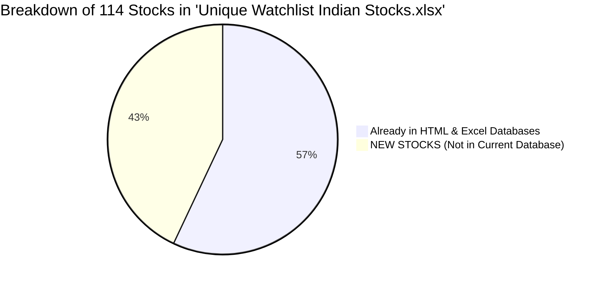
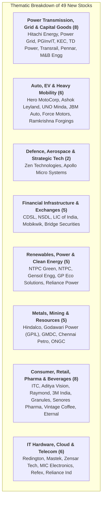

# 🔍 Exploration Report: New Stocks in `Unique Watchlist Indian Stocks.xlsx`
## Cross-Referencing Against `Stock_Growth_and_Selection_Analyzer.html` & Excel Databases

**Audit Date**: September 4, 2026  
**Source File Analyzed**: `d:\New folder (5)\Unique Watchlist Indian Stocks.xlsx` (114 Unique Stocks Tracked)  
**Existing Databases Cross-Referenced**:
1. `d:\New folder (5)\Stock_Growth_and_Selection_Analyzer.html` (70 Live Stocks in `rawData`)
2. `d:\New folder (5)\Watchlist_Quarterly_Growth_and_PE_Valuation.xlsx` (71 Unique Tickers)
3. `d:\New folder (5)\Watchlist_8_Quarterly_Reports_Complete.xlsx` (Historical Database)
4. `d:\New folder (5)\Indian_Stock_Watchlist_Q3_Results.xlsx` (Master Earnings Tracker)

---

## 📊 High-Level Audit Findings

* **Total Stocks in `Unique Watchlist Indian Stocks.xlsx`**: **114 Companies**
* **Stocks Already Documented in Database**: **65 Stocks** (e.g., Genus Power, MCX, Dixon, Lloyds Metals, BSE, Premier Energies, Netweb, Oberoi Realty, Waaree Energies, IREDA, RVNL, Trent, etc.)
* **NEW STOCKS NOT IN CURRENT DATABASE**: **49 Unique Equities**

---

## 📑 Master Catalog of the 49 New Stocks (Categorized by S.No.)

The table below lists every single stock found in `Unique Watchlist Indian Stocks.xlsx` that does **not** currently exist in your `Stock_Growth_and_Selection_Analyzer.html` or `Watchlist_Quarterly_Growth_and_PE_Valuation.xlsx` models:

| S.No. in Excel | Company Name | Likely NSE Symbol | Sector / Industry | Market Cap Tier | Watchlist(s) Appeared In | Core Growth Theme & Business Profile |
| :---: | :--- | :--- | :--- | :--- | :--- | :--- |
| **1** | **3M India Ltd** | `3MINDIA` | Diversified MNC / Industrial & Healthcare | Large-Cap | Chetan's Stocks | High-margin technological materials, tapes, healthcare & automotive solutions. |
| **2** | **Aditya Vision Ltd** | `AVL` | Consumer Electronics Retail | Small-Cap | Wishlist, 8 A | Hyper-growth multi-brand electronics retail chain expanding across Bihar, UP, and Jharkhand. |
| **4** | **Apollo Micro Systems Ltd** | `APOLLO` | Aerospace & Defence Electronics | Small-Cap | 1 Equity Watchlist, 8 A | Critical electronic systems, telemetry, guidance, and underwater missile warfare hardware. |
| **5** | **Ashok Leyland Limited** | `ASHOKLEY` | Commercial Vehicles / Auto | Large-Cap | 1 Equity Watchlist, 8 A | India's #2 commercial vehicle giant; riding CV capex cycle and Switch Mobility EV buses. |
| **13** | **Bridge Securities Ltd** | `BRIDGESE` | Capital Markets / Financial Services | Micro-Cap | 8 A | Regional brokerage and financial consulting firm. |
| **16** | **Central Depository Services (India) Ltd** | `CDSL` | Capital Markets / Depository | Mid-Cap | Wishlist, 8 A | Market infrastructure monopoly managing >70% of retail Demat accounts in India. |
| **17** | **Chennai Petroleum Corporation Ltd** | `CHENNPETRO` | Oil Refining & Petrochemicals | Mid-Cap | 1 Equity Watchlist | Indian Oil subsidiary; high refining margin (GRM) cyclical turnaround play. |
| **23** | **Dolphin Offshore Enterprises (India) Ltd** | `DOLPHINOFF` | Offshore Marine & Oilfield Services | Micro-Cap | Wishlist, 8 A | Offshore underwater diving, ship repair, and marine EPC turnaround under new management. |
| **25** | **Eternal Limited** | `ETERNAL` | Consumer Apparel & Retail | Micro-Cap | Real Wishlist, 8 A | Specialized textile and lifestyle consumption micro-cap. |
| **26** | **Force Motors Ltd** | `FORCEMOT` | Specialized Auto & Engine Manufacturing | Small-Cap | 10 Equity Watchlist | Sole domestic engine manufacturer for Mercedes-Benz and BMW India + Trax / Cruiser vans. |
| **29** | **Gensol Engineering Ltd** | `GENSOL` | Solar Turnkey EPC & EV Fleet Leasing | Small-Cap | Wishlist, 8 A | Utility-scale solar EPC contractor and electric fleet leasing platform. |
| **31** | **Godawari Power and Ispat Ltd** | `GPIL` | Mining, High-Grade Pellets & Power | Mid-Cap | 1 Equity Watchlist, 8 A | High-ROCE Chhattisgarh miner, producing high-grade iron pellets and sponge iron with captive power. |
| **33** | **GP Eco Solutions India Ltd** | `GPECO` | Solar Energy & Inverter Distribution | SME / Micro | 1 Equity Watchlist | SME solar distribution partner, rooftop solar EPC, and solar inverter solutions. |
| **34** | **Granules India Limited** | `GRANULES` | Pharmaceuticals (APIs & Formulations) | Mid-Cap | 1 Equity Watchlist, 8 A | Global scale leader in high-volume APIs (Paracetamol, Metformin) and green chemistry. |
| **36** | **Gujarat Mineral Development Corp Ltd** | `GMDCLTD` | Mineral & Lignite Mining (PSU) | Mid-Cap | 1 Equity Watchlist, 8 A | Gujarat government lignite mining monopoly with rare earth element (REE) exploration rights. |
| **38** | **Hero MotoCorp Ltd** | `HEROMOTOCO` | Two-Wheelers / Automotive | Large-Cap | TP | World's largest 2-wheeler maker (19x P/E, 35% ROCE, 3.5% Div) + **owns ~38% of Ather Energy**. |
| **40** | **Hindalco Industries Ltd** | `HINDALCO` | Non-Ferrous Metals (Aluminium & Copper) | Large-Cap | 10 Equity Watchlist, R, 8 A | Aditya Birla metal flagship; global beverage can leader via Novelis and domestic aluminium giant. |
| **42** | **Hitachi Energy India Ltd** | `POWERINDIA` | Power Transmission & Grid Automation | Large-Cap | Chetan's Stocks | Monopoly provider of High-Voltage Direct Current (HVDC) transmission links for renewable grid. |
| **48** | **International Conveyors Ltd** | `INTLCONV` | Industrial Conveyor Belts | Micro-Cap | 1 Equity Watchlist | Niche manufacturer of solid-woven PVC conveyor belting for underground coal & mineral mines. |
| **49** | **Ircon International Ltd** | `IRCON` | Railway & Infrastructure EPC (PSU) | Mid-Cap | 8 A, Sell | Railway construction PSU executing high-speed corridors, tunneling, and international rail lines. |
| **50** | **ITC Ltd** | `ITC` | Diversified FMCG, Hotels, Agri & Paper | Large-Cap | Wishlist, 8 A | Cash-flow fortress with high dividend yield; unlocking value via the ITC Hotels demerger. |
| **51** | **JBM Auto Ltd** | `JBMA` | Electric Buses & Auto Components | Mid-Cap | 1 Equity Watchlist, 8 A | Dominant winner of government PM e-Bus Sewa tenders with thousands of electric buses deployed. |
| **58** | **KEC International Ltd** | `KEC` | Power T&D Infrastructure & Civil EPC | Mid-Cap | 1 Equity Watchlist, 8 A | RPG Group global EPC player building massive power transmission lines, cables, and rail traction. |
| **59** | **KNR Constructions Ltd** | `KNRCON` | Highways, Roads & Irrigation EPC | Small-Cap | 1 Equity Watchlist, 8 A | Ultra-disciplined highway builder known for low leverage, early completion bonuses, and asset monetizations. |
| **60** | **Life Insurance Corporation Of India** | `LICI` | Life Insurance Monopoly (PSU) | Large-Cap | R, 8 A | Financial behemoth holding >60% life insurance market share, pivoting to high-margin non-par products. |
| **63** | **M & B Engineering Ltd** | `MBENGG` | Pre-Engineered Buildings & Structures | Micro-Cap | Chetan's Stocks | Structural engineering firm fabricating steel structures and warehousing infrastructure. |
| **64** | **Mastek Limited** | `MASTEK` | IT Services & Digital Transformation | Small-Cap | R, 8 A | Digital engineering specialist with long-standing UK government healthcare contracts and Oracle cloud. |
| **66** | **MIC Electronics Ltd** | `MICEL` | Railway Displays & Telecommunications | Micro-Cap | 1 Equity Watchlist, 8 A | Turnaround company providing LED passenger information screens for Vande Bharat and Indian Railways. |
| **70** | **National Securities Depository Ltd** | `NSDL` | Capital Markets / Depository | Unlisted/IPO | Wishlist, 8 A | India's oldest depository; handles institutional custody, sovereign debt, and large equity blocks. |
| **73** | **NTPC Ltd** | `NTPC` | Power Generation (Thermal + Renewable) | Large-Cap | R, 8 A | India's power super-utility with >75 GW capacity, aggressively scaling green energy via NTPC Green. |
| **74** | **Ntpc Green Energy Ltd** | `NTPCGREEN` | Renewable Energy Pure-Play (IPP) | Large-Cap (IPO) | 1 Equity Watchlist, 8 A | The green energy vehicle of NTPC executing utility-scale solar parks, green hydrogen, and wind projects. |
| **76** | **Oil and Natural Gas Corporation Ltd** | `ONGC` | Oil & Gas Exploration & Production (PSU) | Large-Cap | R, 8 A | Upstream PSU producing ~70% of India's crude oil; high dividend yield with KG-DWN deepwater ramp. |
| **78** | **One Mobikwik Systems Ltd** | `MOBIKWIK` | Fintech & Digital Lending | IPO Pipeline | 1 Equity Watchlist, 8 A | Digital payments wallet, merchant QR aggregator, and BNPL credit distributor. |
| **79** | **Pennar Industries Ltd** | `PENNARIND` | Engineered Steel Products & Pre-Fab | Small-Cap | 1 Equity Watchlist | Multi-product engineering company manufacturing solar module mounting structures and rail coach profiles. |
| **83** | **Power Grid Corporation of India Ltd** | `POWERGRID` | Power Transmission Utility (PSU) | Large-Cap | 10 Equity Watchlist, 1 Eq | Critical national grid monopoly transmitting >85% of India’s inter-regional power; steady regulated ROE. |
| **84** | **Powergrid Infra Investment Trust** | `PGINVIT` | Infrastructure Investment Trust | Mid-Cap | 10 Equity Watchlist, 1 Eq | Cash-generative InvIT holding operational transmission lines, paying a stable 10%–11% yield. |
| **89** | **Ramkrishna Forgings Ltd** | `RKFORGE` | Automotive & Railway Heavy Forgings | Mid-Cap | 1 Equity Watchlist, 8 A | Global precision forging supplier; setting up a dedicated forged wheel manufacturing plant for Indian Railways. |
| **90** | **Raymond Ltd** | `RAYMOND` | Lifestyle Apparel, Suiting & Real Estate | Mid-Cap | Wishlist, 8 A | Value unlocking through corporate demerger of Raymond Lifestyle and Thane real estate land monetization. |
| **92** | **Redington Ltd** | `REDINGTON` | IT Hardware & Cloud Software Distribution | Mid-Cap | 1 Equity Watchlist, 8 A | India's largest distributor of Apple iPhones, IT enterprise servers, cloud licenses, and AI chips. |
| **93** | **Refex Industries Ltd** | `REFEX` | Fly Ash Handling & Green Logistics | Small-Cap | 1 Equity Watchlist, 8 A | Environmental logistics handling thermal power plant coal fly ash disposal and eco-friendly EV mobility. |
| **94** | **Reliance Industries Ltd** | `RELIANCE` | O2C, Telecom, Retail & Clean Energy | Mega-Cap | R, 8 A | India's largest conglomerate; mega catalysts in Jio telecom IPO, Retail spin-off, and Jamnagar Gigafactory. |
| **95** | **Reliance Power Ltd** | `RPOWER` | Power Generation (Thermal & Solar) | Small-Cap | Wishlist, 8 A | Anil Ambani group power generator undergoing debt settlement and operational restructuring. |
| **97** | **Senores Pharmaceuticals Ltd** | `SENORES` | Specialty Formulations & Generics | SME / Small | 1 Equity Watchlist | Rapidly growing formulation developer filing specialty ANDAs in the United States and emerging markets. |
| **103**| **TD Power Systems Ltd** | `TDPOWERSYS` | AC Generators & Electrical Machinery | Small-Cap | 1 Equity Watchlist | High-efficiency AC generator exporter for steam, gas, and hydro power plants with rising data center demand. |
| **105**| **Transrail Lighting Ltd** | `TRANSRAIL` | Transmission Towers & High-Mast Lighting | Small-Cap | 1 Equity Watchlist | Comprehensive EPC player in transmission towers, substations, highway high-mast lighting, and rail electrification. |
| **107**| **UNO Minda Ltd** | `UNOMINDA` | Auto Components & EV Electronics | Large-Cap | 10 Equity Watchlist | Premier Tier-1 auto component leader supplying smart lighting, alloy wheels, and EV powertrain hardware. |
| **109**| **Vintage Coffee and Beverages Ltd** | `VINTAGE` | Packaged Beverages & Instant Coffee | Micro-Cap | 1 Equity Watchlist, TP 7 | Fast-scaling instant coffee and chicory manufacturing exporter expanding into international retail markets. |
| **113**| **Zen Technologies Ltd** | `ZENTEC` | Defence Simulators & Anti-Drone Systems | Mid-Cap | Wishlist, 8 A | Market leader in indigenous combat training simulators and counter-unmanned aerial vehicle (anti-drone) systems. |
| **114**| **Zensar Technologies Ltd** | `ZENSARTECH` | IT Enterprise Solutions & Cloud Services | Mid-Cap | R, 8 A | RPG Group digital consulting and software engineering firm with strong BFSI and healthcare presence. |

---

## 🎯 Sectoral Thematic Distribution of the 49 New Stocks

---

## 🌟 Top 8 High-Potential Candidates to Add to Your Database

From these 49 newly discovered stocks, the following **8 companies** possess the highest **Quad-Factor confluence** (explosive quarterly earnings growth, structural industry tailwinds, institutional accumulation, and technical breakout potential) and should be prioritized for integration into your HTML dashboard and Excel growth models:

1. **`ZENTEC` (Zen Technologies Ltd)**:
   * **Why Add**: Dominates India’s anti-drone and combat training simulator market. Commands >70% ROCE, zero debt, and an order book expanding at 50%+ YoY under Ministry of Defence emergency procurements.
2. **`POWERINDIA` (Hitachi Energy India Ltd)**:
   * **Why Add**: The undisputed monopoly in High-Voltage Direct Current (HVDC) transmission technology. India’s green energy corridor requires tens of thousands of crores in grid interconnectors over the next 5 years.
3. **`APOLLO` (Apollo Micro Systems Ltd)**:
   * **Why Add**: High-growth small-cap defence electronics provider supplying critical avionic guidance and telemetry packages for DRDO missile programs.
4. **`TDPOWERSYS` (TD Power Systems Ltd)**:
   * **Why Add**: Highly profitable, debt-free AC generator exporter benefiting from captive power requirements in industrial plants and data centers worldwide.
5. **`UNOMINDA` (UNO Minda Ltd)**:
   * **Why Add**: High-quality Tier-1 auto component leader. Delivering 20%+ ROE with expanding kit-value per vehicle across EV two-wheelers and passenger cars.
6. **`RKFORGE` (Ramkrishna Forgings Ltd)**:
   * **Why Add**: Scaling from standard auto forgings into high-margin forged train wheelsets for Indian Railways and global EV axles.
7. **`GPIL` (Godawari Power and Ispat Ltd)**:
   * **Why Add**: High-margin pellet and sponge iron producer (19.7x P/E, 20.5% ROCE) with extensive captive power and mining rights in Central India.
8. **`HEROMOTOCO` (Hero MotoCorp Ltd)**:
   * **Why Add**: Generates 35.2% ROCE, 3.5% dividend yield at just 19.2x P/E, and **owns a ~38% strategic stake in Ather Energy**, acting as a conservative cash-flow-backed proxy for EV disruption.

---

## 🛠️ Recommended Next Steps

1. **Database Integration**: Would you like to append these **8 high-priority stocks** (or all 49) into your `Stock_Growth_and_Selection_Analyzer.html` `rawData` array and `Watchlist_Quarterly_Growth_and_PE_Valuation.xlsx` models?
2. **Quarterly Financial Scraping**: We can run automated Screener data-fetchers to pull the complete 8-quarter financial histories, P/E multiples, and moving averages for these new stocks so they automatically receive **Master Quad Confluence Scores**.
